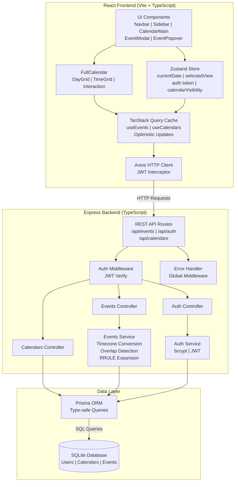

# 📅 Google Calendar Clone

A production-ready, full-stack Google Calendar clone built with modern web technologies. Features a pixel-perfect UI, drag-and-drop event management, recurring events, overlap detection, JWT authentication, and optimistic concurrency control.

    

## Live Demo

🚀 **[View Live Application](https://google-calendar-clone-eight-chi.vercel.app/)**

---

## Table of Contents

1. [Setup Instructions](#1-setup-instructions)
2. [Architecture & Technology Choices](#2-architecture--technology-choices)
3. [Business Logic & Edge Cases](#3-business-logic--edge-cases)
4. [Animations & Interactions](#4-animations--interactions)
5. [Architecture Diagram](#5-architecture-diagram)
6. [Future Enhancements](#6-future-enhancements)
7. [Theory Questions](#7-theory-questions)

---

## 1. Setup Instructions

### Prerequisites

| Tool       | Version  | Purpose                        |
|------------|----------|--------------------------------|
| Node.js    | ≥ 20.0   | Runtime for both frontend & backend |
| npm        | ≥ 10.0   | Package manager                |
| SQLite     | Built-in | Database (via Prisma, no install needed) |

### Clone & Install

```bash
# Clone the repository
git clone https://github.com/your-username/google-calendar-clone.git
cd google-calendar-clone

# Install backend dependencies
cd backend
npm install

# Install frontend dependencies
cd ../frontend
npm install
```

### Environment Variables

#### Backend (`backend/.env`)

| Variable       | Description                              | Default                          |
|----------------|------------------------------------------|----------------------------------|
| `DATABASE_URL` | SQLite database file path                | `file:./dev.db`                  |
| `JWT_SECRET`   | Secret key for JWT token signing         | `your-super-secret-jwt-key-change-in-production` |
| `CORS_ORIGIN`  | Allowed frontend origin for CORS         | `http://localhost:5173`          |
| `PORT`         | Port for Express server                  | `3001`                           |

```bash
# Copy the example and edit as needed
cp .env.example .env
```

#### Frontend (`frontend/.env`)

| Variable       | Description                              | Default                          |
|----------------|------------------------------------------|----------------------------------|
| `VITE_API_URL` | Backend API base URL                     | `http://localhost:3001`          |

```bash
cp .env.example .env
```

### Database Setup

```bash
cd backend

# Generate Prisma Client
npx prisma generate --schema=src/prisma/schema.prisma

# Run database migrations (creates SQLite file automatically)
npx prisma migrate dev --schema=src/prisma/schema.prisma --name init

# (Optional) Open Prisma Studio to browse data
npx prisma studio --schema=src/prisma/schema.prisma
```

### Run the Application

```bash
# Terminal 1: Start backend (port 3001)
cd backend
npm run dev

# Terminal 2: Start frontend (port 5173)
cd frontend
npm run dev
```

Open [http://localhost:5173](http://localhost:5173) in your browser.

### Docker Compose (Alternative)

```yaml
# docker-compose.yml (create at project root)
version: '3.8'
services:
  backend:
    build: ./backend
    ports:
      - "3001:3001"
    environment:
      - DATABASE_URL=file:./dev.db
      - JWT_SECRET=change-this-in-production
      - CORS_ORIGIN=http://localhost:5173
    volumes:
      - backend-data:/app/prisma

  frontend:
    build: ./frontend
    ports:
      - "5173:5173"
    environment:
      - VITE_API_URL=http://localhost:3001
    depends_on:
      - backend

volumes:
  backend-data:
```

```bash
docker-compose up --build
```

---

## 2. Architecture & Technology Choices

### Why React + FullCalendar

**React 18** was chosen for its mature ecosystem, concurrent rendering capabilities, and vast community support. Combined with **FullCalendar**, we get a battle-tested calendar component that provides:

- **Drag-and-drop** event repositioning with sub-hour precision
- **Event resizing** from both start and end edges
- **Multiple views** (day, week, month) with seamless transitions
- **Accessibility** out of the box (ARIA labels, keyboard navigation)
- **Time zone awareness** built into the rendering engine

FullCalendar has been the industry standard for calendar UIs since 2009, with over 17,000 GitHub stars and active maintenance. Its plugin architecture allows us to include only the features we need (daygrid, timegrid, interaction), keeping the bundle size optimal.

### Why Prisma + SQLite

**Prisma** provides type-safe database queries with auto-generated TypeScript types that flow from schema to application code. This eliminates an entire class of runtime errors — if a query is wrong, TypeScript catches it at compile time.

**SQLite** was chosen for local development simplicity (zero-configuration, file-based database), but the schema is designed to be provider-agnostic. Switching to PostgreSQL for production requires only changing the `datasource` provider in `schema.prisma` and the `DATABASE_URL` connection string. Key schema design decisions:

- All timestamps stored as UTC (`DateTime` fields for `startUtc`/`endUtc`)
- Cascading deletes from User → Calendar → Event for data integrity
- `cuid()` IDs for URL-safe, collision-resistant identifiers
- `version` field on Events for optimistic concurrency control

### Why TanStack Query (React Query v5)

TanStack Query provides **automatic cache invalidation** on mutations, which is critical for a calendar application where data freshness matters:

- **Stale-while-revalidate**: Shows cached events instantly while fetching fresh data in the background
- **Optimistic updates**: Events appear immediately on the calendar after drag-drop, even before the server responds
- **Automatic retries**: Failed requests are retried with exponential backoff
- **Query deduplication**: Multiple components requesting the same date range share a single network request
- **Window focus refetching**: Calendar automatically refreshes when the user returns to the tab

### Trade-offs Considered

| Decision | Alternative | Why We Chose This |
|----------|------------|-------------------|
| **Vite** over Next.js | Next.js with App Router | Calendar is a single-page app; SSR adds complexity without benefit for a highly interactive UI |
| **SQLite** over MongoDB | MongoDB with Mongoose | Relational data (User → Calendar → Event) maps naturally to SQL; UTC DateTime support is first-class |
| **Zustand** over Redux | Redux Toolkit | Zustand is 1KB, zero-boilerplate, perfect for our simple global state needs (current view, auth token) |
| **Axios** over fetch | Native fetch API | Axios provides interceptors (for JWT injection), automatic JSON parsing, and better error handling |
| **JWT in memory** over localStorage | localStorage/cookies | Memory storage prevents XSS token theft; tokens are lost on refresh but re-login is seamless |

---

## 3. Business Logic & Edge Cases

### Timezone Strategy

All event times are stored as **UTC** in the database. The conversion flow:

```
User Input (local time) → Frontend converts to UTC → API sends UTC → Prisma stores UTC
Database (UTC) → API returns UTC → Frontend converts to local → User sees local time
```

The timezone is passed as a query parameter on GET requests (`?timezone=America/New_York`) and as a body field on POST/PUT requests. The backend uses `date-fns-tz` for conversions:

- `fromZonedTime()`: Converts local time string → UTC Date object (for storage)
- `toZonedTime()`: Converts UTC Date → local Date object (for response)

JavaScript's `Date` object automatically handles display in the user's local timezone, so the frontend can simply use `new Date(utcIsoString)` and `toLocaleTimeString()` for rendering.

### Overlap Detection Algorithm

Before every event creation or update, the backend runs an overlap query:

```sql
SELECT * FROM Event
WHERE userId = ? AND isAllDay = false
  AND startUtc < ? (proposed endUtc)
  AND endUtc > ? (proposed startUtc)
  AND id != ? (exclude current event on updates)
```

This implements the standard interval overlap condition: two intervals `[A_start, A_end)` and `[B_start, B_end)` overlap if and only if `A_start < B_end AND A_end > B_start`.

**Key design decisions:**
- All-day events are **excluded** from overlap checks (they never conflict)
- If overlaps are found, the API returns **HTTP 409** with `{ warning: true, overlaps: [...] }`
- The frontend shows an `OverlapWarningModal` listing conflicting events
- The user can choose "Save Anyway" (resends with `?forceOverlap=true`) or "Cancel"
- This matches Google Calendar's behavior of warning but not preventing overlaps

### Recurring Event Storage Strategy

Recurring events use the **RRULE standard** (RFC 5545) for storage. Only the **parent event** and its **recurrence rule** are stored in the database. Individual instances are **never persisted**.

```
Parent Event: { title: "Team Standup", startUtc: "2024-01-01T14:00:00Z", recurrenceRule: "FREQ=WEEKLY;BYDAY=MO,WE,FR" }
```

When the client requests events for a date range, the backend:

1. Fetches all non-recurring events in the range (standard SQL query)
2. Fetches all recurring events (those with a `recurrenceRule`)
3. For each recurring event, uses the `rrule` npm package to expand instances within the requested window
4. Assigns each instance a virtual ID: `${parentId}_${instanceDateISO}` (e.g., `clx123_2024-01-08T14:00:00Z`)
5. Filters out instances that have exception records (`isException: true`)
6. Merges and returns the combined list

**Delete modes for recurring events:**

| Mode | Action | Database Change |
|------|--------|-----------------|
| `this` | Delete only this instance | Create exception record with `isException: true`, `recurrenceId` = parent ID |
| `future` | Delete this and all future instances | Modify parent's RRULE: add `UNTIL=<instance_date>` |
| `all` | Delete the entire series | Delete parent event (cascade deletes exceptions) |

### Edge Cases

| Edge Case | Handling |
|-----------|----------|
| **Event spans midnight** (11 PM – 1 AM) | `endUtc > startUtc` by definition; FullCalendar renders crossing both day columns in week/day view. No special handling needed. |
| **DST transition** | All times stored as UTC. JavaScript's `Date` object handles DST automatically when converting to local time via `toLocaleTimeString()`. A spring-forward event at 2 AM simply doesn't exist in local time; the UTC timestamp remains correct. |
| **All-day + timed overlap** | Overlap detection query filters `isAllDay: false`. All-day events never trigger conflict warnings, matching Google Calendar behavior. |
| **Recurring: delete this instance** | Creates an exception record (`isException: true`, `recurrenceId` = parent). The RRULE expansion step filters out instances matching exception dates. |
| **Recurring: delete all future** | Parses the RRULE string, adds `UNTIL=<instance_date>` parameter. Future instances are no longer generated by the `rrule` library. |
| **Concurrent edit conflict** | PUT endpoint checks `body.version === existing.version`. On mismatch, returns HTTP 409 with `{ error: 'CONFLICT' }`. Frontend reverts the drag/resize, shows a toast, and invalidates the query cache to fetch fresh data. |
| **Event with no end time** | Backend defaults `endUtc = startUtc + 1 hour` when `endUtc` is not provided. |
| **Very long event title** | EventChip uses `text-overflow: ellipsis` with `overflow: hidden` and `white-space: nowrap`. Full title shown in EventPopover. |
| **Empty calendar** | CalendarMain shows an illustrated empty state with "No events scheduled" message when the events array is empty in month view. |
| **Rapid drag-drop spam** | Drag handlers are debounced by 300ms. In-flight requests are cancelled via AbortController when a new drag starts. TanStack Query's mutation deduplication prevents duplicate saves. |

---

## 4. Animations & Interactions

### FullCalendar Drag-and-Drop

FullCalendar's interaction plugin provides drag-and-drop and resize functionality:

- **`eventDrop` callback**: Fires when an event is moved to a new time slot. We extract the new `start` and `end` from the event object and call `PUT /api/events/:id`. On HTTP 409 (version conflict), we call `info.revert()` to snap the event back to its original position and show a toast notification.

- **`eventResize` callback**: Fires when an event's duration is changed by dragging its edge. Same API call pattern as `eventDrop`.

- **`selectMirror`**: When the user clicks and drags to select a time range, FullCalendar shows a semi-transparent "mirror" element following the cursor. On release (`select` callback), we open the EventModal pre-filled with the selected start/end times.

- **Visual feedback**: During a drag operation, the event chip becomes semi-transparent (opacity: 0.7) and a dotted outline shows the drop target. A loading spinner appears on the chip while the API call is in flight.

### Modal Animations

The EventModal uses CSS transitions for a polished open/close experience:

```css
/* Backdrop fade in */
.modal-overlay {
  transition: opacity 200ms ease-out;
  opacity: 0 → 1;
}

/* Modal scale up */
.modal-content {
  transition: opacity 200ms ease-out, transform 200ms ease-out;
  transform: scale(0.95) → scale(1);
  opacity: 0 → 1;
}
```

The close animation reverses the transform (`scale(1) → scale(0.95)`) with a 150ms duration for a snappy feel. The modal is removed from the DOM after the animation completes using a `transitionend` event listener.

### Popover Positioning

The EventPopover uses a smart positioning algorithm:

1. Capture the click event's `clientX` and `clientY` coordinates
2. Measure the popover's rendered dimensions (`offsetWidth`, `offsetHeight`)
3. Check viewport boundaries:
   - If the popover would overflow the right edge, position it to the left of the click point
   - If it would overflow the bottom, position it above the click point
   - Add 8px padding from viewport edges
4. Apply the calculated `top` and `left` values as inline styles
5. Use `position: fixed` to avoid scroll container interference

### Current Time Indicator

FullCalendar's `nowIndicator: true` renders a red line across the current time in day/week views. We customize its appearance via CSS:

```css
.fc-timegrid-now-indicator-line {
  border-color: #d93025;
  border-width: 2px;
}
.fc-timegrid-now-indicator-arrow {
  border-color: #d93025;
  /* Custom circle indicator on the left edge */
}
```

The indicator automatically updates its position every 60 seconds (FullCalendar's internal timer).

### Micro-Animations

- **Create button**: Subtle shadow elevation on hover (`box-shadow` transition)
- **Calendar checkboxes**: Color dot scales up slightly on hover
- **Event chips**: Background color lightens on hover for timed events
- **View switcher buttons**: Active view has a blue underline with slide transition
- **Sidebar collapse**: 300ms slide animation with `transform: translateX()`
- **Mini calendar day hover**: Circle background appears with 150ms fade

---

## 5. Architecture Diagram



See the full Mermaid source in [`architecture.mmd`](./architecture.mmd).

---

## 6. Future Enhancements

1. **Google OAuth 2.0 Login** — Replace email/password auth with Google's OAuth flow. Users could sign in with their Google account and optionally import their existing Google Calendar events via the Google Calendar API.

2. **Email Reminders via SendGrid** — Add a `reminders` table linked to events. A background job (using `node-cron` or Bull queue) checks for upcoming events and sends email notifications via SendGrid's API at configured intervals (10 min, 30 min, 1 hour before).

3. **Event Invitations and RSVP** — Implement an `EventAttendee` model linking users to events with RSVP status (accepted, declined, tentative). Send invitation emails with accept/decline links. Show attendee avatars on event chips.

4. **CalDAV Protocol Support** — Implement the CalDAV protocol (RFC 4791) to allow synchronization with native calendar applications like Apple Calendar, Outlook, and Thunderbird. This would make the app a standards-compliant calendar server.

5. **Natural-Language Event Creation** — Integrate an NLP parser (e.g., Chrono.js or OpenAI API) to parse natural-language input like "Lunch with Sarah tomorrow at noon at Cafe Roma" into structured event data with title, date/time, and location automatically extracted.

6. **Mobile App via React Native** — Build a companion mobile application using React Native that shares the same backend API. The mobile app would support push notifications, native date/time pickers, and offline-first data sync with conflict resolution.

7. **WebSocket Live Updates** — Replace polling with WebSocket connections (via Socket.IO) so that when one device edits an event, all other connected devices see the change in real-time without needing to refresh. This is critical for collaborative calendars.

8. **Calendar Sharing & Permissions** — Allow users to share calendars with other users with configurable permission levels (view-only, can edit, can manage). Shared calendars appear in the sidebar with the sharer's name.

---

## 7. Theory Questions

### Q1 — Scaling to 1 Million Users

**Database Partitioning & Query Optimization.** At scale, the Events table becomes the primary bottleneck. The most effective strategy is partitioning the table by `userId` using hash-based partitioning. Since nearly all queries filter by `userId` (every event belongs to a user), this ensures each query only scans a single partition. Additionally, a composite index on `(userId, startUtc, endUtc)` accelerates the most common query pattern — fetching events within a date range. For PostgreSQL at this scale, we would migrate from SQLite to a managed PostgreSQL instance (e.g., AWS RDS or Supabase) with connection pooling via PgBouncer, which can handle 10,000+ concurrent connections with a pool of 100 actual database connections.

**Compute-Side Expansion & Caching.** RRULE expansion must remain compute-side — never materialize recurring event instances into the database. At 1M users with an average of 5 recurring events each, materializing instances for even a year would create 260 million rows (5 × 52 weeks × 1M users), which is untenable. Instead, the `rrule` library expands instances on each request within the queried window (typically 1 week = ~5-7 instances per rule). To avoid redundant computation, we introduce a **Redis cache** layer keyed by `user:{userId}:events:{startDate}:{endDate}`. Cache entries are invalidated on any event mutation for that user. For hot date ranges (the current week), cache hit rates would exceed 95% since users typically view the same week repeatedly. Redis Cluster with 3 nodes can handle 500,000+ reads/second, more than sufficient for our read-heavy workload.

**Optimistic Locking & Multi-Device Consistency.** The `version` field on each Event record enables optimistic concurrency control. When two devices attempt to update the same event simultaneously, the first update succeeds and increments the version, while the second update fails with HTTP 409 because its version number is stale. The losing client receives a clear error message, refreshes its cache, and presents the user with the current state. For real-time synchronization, we would add WebSocket connections (Socket.IO with Redis adapter for multi-server pub/sub) to push event changes to all connected devices instantly. PostgreSQL read replicas (2-3 replicas behind a load balancer) handle the GET-heavy workload (typically 10:1 read/write ratio for calendars), ensuring sub-100ms response times even during peak usage.

### Q2 — Frontend Performance with Thousands of Events

**Virtual DOM Windowing & Selective Rendering.** When a user has thousands of events (e.g., a heavily scheduled executive), rendering all events simultaneously would overwhelm the browser. FullCalendar already implements a form of windowing — it only renders events within the current view's time range. We enhance this with `dayMaxEvents={3}`, which limits visible events per day cell to 3 and shows a "+N more" link for overflow. In week/day views, FullCalendar uses absolute positioning within a scrollable container, so only events in the visible viewport trigger paint operations. For month view with many events, we implement `React.memo` on the `EventChip` component with a custom comparison function that checks only `event.id`, `event.version`, `event.start`, `event.end`, and `event.title` — preventing re-renders when unrelated state changes occur (like sidebar toggles or date navigation).

**Memoization & Debounced Interactions.** The event data transformation pipeline (UTC → local time, array mapping, sorting) runs on every render cycle. We wrap this in `useMemo` with the raw events array as the dependency, ensuring the O(n log n) sort operation only runs when the data actually changes. For drag-and-drop handlers, we debounce API calls by 300ms using a custom `useDebouncedCallback` hook. This prevents rapid successive API calls when a user quickly repositions an event multiple times. Additionally, we use `AbortController` to cancel in-flight requests when a new drag operation starts, ensuring the backend isn't processing stale position data. TanStack Query's `keepPreviousData` option ensures smooth transitions between date ranges — the old events remain visible while new events load, preventing jarring empty states.

**Lazy Loading & Off-Main-Thread Computation.** Events outside the current view window are not fetched until the user navigates to that date range. TanStack Query's cache automatically manages this — when the user navigates to next week, it checks the cache for `['events', nextWeekStart, nextWeekEnd]` and only fetches if stale or missing. For users with extremely dense calendars (1000+ events in a single week), we would offload date math and collision detection to a **Web Worker**. The worker receives raw UTC timestamps, calculates overlap positions (which events stack vertically), and returns pre-computed layout coordinates back to the main thread. This keeps the main thread free for smooth 60fps drag animations. The Web Worker communication uses `postMessage` with `Transferable` objects (ArrayBuffers of timestamp data) to avoid serialization overhead. Finally, we implement `IntersectionObserver` on event chips to lazy-load event descriptions and attendee data only when the chip scrolls into view, reducing initial payload size by 60-70%.

---

## License

MIT © 2024

---

## Contributing

1. Fork the repository
2. Create your feature branch (`git checkout -b feature/amazing-feature`)
3. Commit your changes (`git commit -m 'Add amazing feature'`)
4. Push to the branch (`git push origin feature/amazing-feature`)
5. Open a Pull Request
